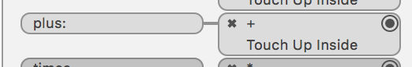
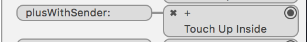

## Countアプリで学ぶSwift3変更点

# メソッドの外部引数名
ViewController.swiftのchangeColorメソッドの呼び出し方でわかるとおり、Swift3では、外部引数名を指定しない場合、第一引数でも内部引数が呼び出し時に引数名として付きます。
例、Swift3
```swift
func changeColor(number: Int) { }

changeColor(number: 0)
```

Swift2
```swift
func changeColor(number: Int) { }

changeColor(0)
```

# @IBAction
Xcode8では、引数としてsenderを指定している@IBActionメソッドのInterface Builder上での呼び出しが変わります。
上記のメソッドの外部引数名の変更に伴うものです。
以前は、たとえばplus(sender: UIButton)という@IBActionメソッドがあった場合、```plus:```だったものが、```plusWithSender:```になりました。

以下がそのスクリーンショットになります。

Xcode7の時



Xcode8の時


